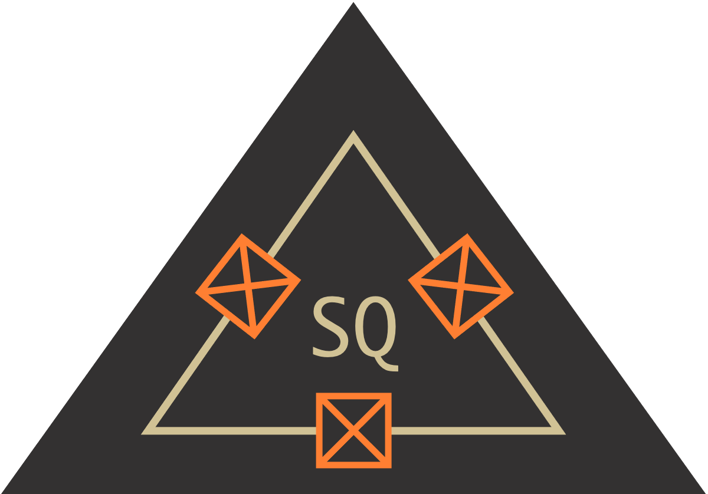

Superconducting Quantum Circuits in Python
=====================================================

   SQcircuit is an open-source Python library that is capable of analyzing an arbitrary superconducting quantum circuit. SQcircuit uses the theory discussed in [1] to describe the Hamiltonian in the appropriate basis and to effectively find the energy spectrum and eigenvectors of the circuit. To design the desired quantum circuit and to discover new qubits, additional functionalities and methods are provided to extract the circuit properties such as matrix elements, dephasing rate, decay rates, etc.

   [1] To be published soon

.. toctree::
   :maxdepth: 2

   installation.rst
   examples.rst
   quickTutorial.rst
   guides/guides.rst
   apidoc/apidoc.rst
   contributors.rst

