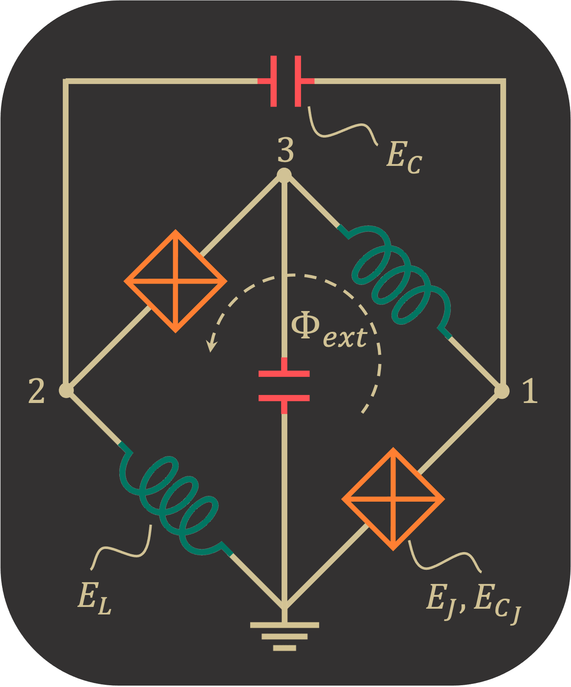

.. _quickTutor:

***************
Quick Tutorial
***************

To show a quick overview of how to use SQcircuit, we find the qubit frequency for the symmetric zero-pi qubit with the
following parameters in gigahertz: E_C=0.15, E_CJ=10, E_L=0.13 , and E_J=5.   

|

After installing the SQcircuit, we import it via:

.. code-block:: python

   # import the SQcircuit library
   import SQcircuit as sq

Since zero-pi qubit has a single inductive loop, we define its loop by creating a loop object from `Loop` class with
flux bias at frustration point:

.. code-block:: python

   # inductive loop of zero-pi qubit with flux bias at its frustration point.
   loop1 = sq.Loop(value=0.5)

We can later change the value of the flux bias by `setFlux()` method. Each circuit component in SQcircuit has their
own class definition `Capacitor` class for capacitors, `Inductor` class for inductors, and `Junction` class for
Josephson junctions. We define the elements of our zero-pi circuit as following:

.. code-block:: python

   # capacitors
   C = sq.Capacitor(value =0.15,  unit="GHz")
   CJ = sq.Capacitor(value=10, unit="GHz")
   # inductors
   L = sq.Inductor(value=0.13, unit="GHz", loops = [loop1])
   # JJs
   JJ = sq.Junction(value=5, unit="GHz", loops=[loop1])

Note that for the inductive elements( inductors as well as Josephson junctions) that are part of an 
inductive loop, one should indicate the loops of which they are involved. For example here we pass `[loop1]` to `loops`
argument for both inductors and Josephson Junctions, because all of them are part of `loop1`. After defining all
components of the circuit, to describe the circuit topology in SQcircuit, one should create an object of `Circuit`
class by passing a Python dictionary that contains the list of all elements at each edge

.. code-block:: python

   # dictionary that contains the list of all elements at each edge
   elements = {(0, 1): [CJ, JJ],
               (0, 2): [L],
               (0, 3): [C],
               (1, 2): [C],
               (1, 3): [L],
               (2, 3): [CJ, JJ]}

   # define the circuit
   cr = sq.Circuit(elements)

One step before diagonalizing the circuit is to define the size of the Hilbert space by specifying the truncation 
numbers for each mode.(For more information about modes and truncation number check the SQcircuit original paper or
the documentation)

.. code-block:: python

   # call this function to set the truncation number for each mode of the circuit. 
   cr.truncationNumbers([25, 1, 25])

We get the first two eigenfrequencies of the circuit to calculate the qubit frequency via:

.. code-block:: python

   # get the first two eigenfrequencies and eigenvectors 
   eigFreq, eigVec = cr.diag(numEig=2)

   # print the qubit frequency
   print("qubit frequency:", eigFreq[1]-eigFreq[0])

The frequency unit in SQcircuit is gigahertz by default. However, one can simply change it by `sq.units.setFreq()` method.
